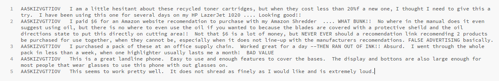

# Authorship Attribution with Document Encodings and Neural Networks

This project uses the popular Doc2Vec and Word2Vec methods to build vocabulary models from short review texts in order to test correlation for a classification neural network. To put it more simply, neural nets, primarily convolutional nets, are trained to try to figure out what author wrote what text from standardized models used to represent the text, rather than the text itself. However, the networks are at best only able to learn a handful of distinct authors before they plateau and get stuck attributing the writing of new authors to those already learned indefinitely. This likely shows that Doc2Vec and Word2Vec-based vocabulary models, which are primarily designed for semantic analysis, are not good models for use with author attribution, which depends more on stylistic analysis. Such stylistic details are abstracted away by those models.

## Getting Started

This will help you get a copy of the project running on your own system.

### Prerequisites

1. This project was made using a Jupyter notebook. You must have Jupyter installed and running to run this project inside a Jupyter notebook as well. You can find help setting up Jupyter on [its install page](http://jupyter.org/install), as well as the prerequisites for it, most importantly Python. Note Jupyter can run on either versions 2.7 or 3.3+ of Python, but this project was written using Python 3.
Furthermore, it uses Keras running on the TensorFlow framework to construct and run neural networks.
2. Download [Google's Pre-Trained Vectors](https://drive.google.com/file/d/0B7XkCwpI5KDYNlNUTTlSS21pQmM/edit?usp=sharing)
3. Install [spaCy](https://spacy.io/) and [spaCy's pre trained vector set](https://spacy.io/models/en)
    * In your terminal:
    ```
    >> pip3 install spacy
    >> python3 -m spacy download en_core_web_lg
    ```
4. Install gensim
    * In your terminal:
    ```
    >> pip3 install gensim
    ```
    * Gensim may require you to install NumPy and SciPy if you do not already have them
    ```
    >> pip3 install numpy
    >> pip3 install scipy
    ```

## Preprocessing

* **Sample Data is in the [data](data/) folder:**
    * [demo\_reviews.txt](data/demo_reviews.txt)
    * [demo\_reversed.txt](data/demo_reversed.txt)


* **It should look like this:**

    authorID [tab] review_text



* **Each script in the [scripts](scripts/) folder performs a variation of an encoding method tested.**

* **Using some of our scripts, you can easily convert any document with the afore mentioned format to be encoded in two different ways:**

    1. Our Custom Encoding (Either utilizing spaCy's pre-trained or Google's pre-trained vectors)
    2. Doc2Vec Encoding
    
* **For our custom encoding utilizing two different sets of pre-trained word vectors, the scripts can be run as follows:**
    
    * Utilizing Google's Pre-trained word vectors
    ```
    ./customDoc2Vec.py [input filename] [output filename]
    ```
    * However, the above requires you have the [Google's Pre-Trained Vectors](https://drive.google.com/file/d/0B7XkCwpI5KDYNlNUTTlSS21pQmM/edit?usp=sharing) in the same location as customDoc2Vec.py 
    
    * Utilizing spaCy's Pre-trained word vectors
    ```
    ./spacyDoc2Vec.py [input filename] [output filename]
    ```
    
* **Instead of pre-trained word vectors to create your own you can do the following:**

    Utilizing Gensim to build and train a Doc2Vec model on your own corpus    
    ```
    ./gensimDoc2Vec.py [input filename] [output filename] [model name]
    ```
   
    
* **The format of the resulting encoding is as follows:**

    authorID [tab] word_vector

* **You can also reverse the sentences in a text corpus by running (it will output the same filename with 'r_' in front):**
    
    ```
    ./reverseText.py [filename] 
    ```
    
    
* **Example:**

    ```
    #Generate your encoded documents
    ./gensimDoc2Vec.py demo\_reviews.txt demo\_encoded.txt demoModel
    ```

* The resulting data file is utilized by the Final Network Jupyter Notebook.

## Running

* **The General Flow of our Final Network is as follows:**
1. Generate Data Files to Train
     ```
    #Example
    ./gensimDoc2Vec.py demo\_reviews.txt demo\_encoded.txt demoModel
    ```
2. Read in the Vectors and Generate One-Hot Encodings
   * Change Parameters:
     * Authors: 3, 35, 100, [you pick]
     * Input Filename: [your output file from preprocessing]
3. Separate Training/Testing Sets
4. Setup Optional Oversampling
5. Shuffle and Reshape
6. Choose Network
   * Networks:
     * Network 1 (CNN with regularizers)
     * Network 2 (CNN)
     * Network 3 (Dense)
7. Start Training
   * Settings:
     * Batch Size: 5
     * Epochs: 5
8. Start Testing
9. Show Graphs
10. Generate Predictions


## Demo
* **To make life easy, [demo](demo/) has a full demo to show you the results of our efforts**
* **Before running the notebook first make sure have every pre-requisite complete**

    * **Steps:**
        1. Open up Jupyter Notebooks and navigate to the demo directory within this project
        2. Generate Training Files
            * For convience [demo](demo/) contains already preprocessed files. However, you may utilize the scripts mentioned in the above Preprocessing section to generate your own input files
        3. Open up the demo.ipynb
            * demo.ipynb is a IPython Notebook set up to walk you through our networks using the provided demo data


## Built With

* [Jupyter](http://jupyter.org/documentation/) - The environment used
* [spaCy](https://spacy.io/) - Industrial-Strength Natural Language Processing
* [Keras](https://keras.io/) - High level API for fast experimentation with networks built on TensorFlow
* [gensim](https://github.com/RaRe-Technologies/gensim) - Used for Doc2Vec capabilities
## Authors

* **Miles Baer** - *Code, Research, Paper, Presentation, Demo*
* **Robert Smith** - *Code, Research, Paper, Presentation, Demo*
* **Nathaniel Boyer** - *Administration and presentation*
* **William Cope** - *Some documentation and administrative assistance*
* **Charles Johnson** - *Research paper drafting*

See also the list of [contributors](https://github.com/CSCI4850/S18-team0-project/contributors) who participated in this project.

## License

This project is licensed under the MIT License.

## Acknowledgments

* [Convolutional Neural Networks for Authorship Attribution of Short Texts by Shrestha et al](http://www.aclweb.org/anthology/E17-2106) - Much of the initial work was based on the work outlined there.
